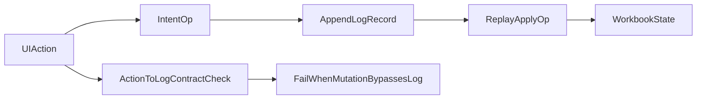

# Log Replay Determinism and UI->Log Contract

## Findings

- Replay currently applies persisted operations in strict file order via [`src/io/mod.rs`](D:/GitHub/corro/src/io/mod.rs) (`load_workbook_revisions*`, `tail_apply_workbook`) and [`src/ops/mod.rs`](D:/GitHub/corro/src/ops/mod.rs) (`apply_log_line_to_workbook`), which is deterministic for a fixed log file.
- UI is not purely log-driven today: several paths directly mutate in-memory state in [`src/ui/mod.rs`](D:/GitHub/corro/src/ui/mod.rs) (e.g., `grow_main_row_at_bottom`, `grow_main_col_at_right`, `ensure_extent_for_cursor`, and no-path `op.apply`).
- “One UI action = one physical log line” is violated in multiple places:
  - multiline cell edits serialize to `SET` + `CONTINUE_LINE` in [`src/ops/mod.rs`](D:/GitHub/corro/src/ops/mod.rs) (`split_multiline_set_lines`).
  - row/col insert actions emit multiple committed ops (`SetMainSize` + `MoveRowRange` / `MoveColRange`) in [`src/ui/mod.rs`](D:/GitHub/corro/src/ui/mod.rs) (`insert_rows_above_*`, `insert_cols_left_of_cursor`).
  - Replace-all loops per-cell (`replace_all_substrings_in_main`) and can emit many `SET` lines for one user action.
  - format-scope actions use batch commit and emit one line per target column (`commit_workbook_set_column_format_batch` in [`src/io/mod.rs`](D:/GitHub/corro/src/io/mod.rs), with expansion logic in `to_log_lines_with_policy` in [`src/ops/mod.rs`](D:/GitHub/corro/src/ops/mod.rs)).
- Determinism risks outside structural replay:
  - `TODAY`/`NOW` depend on wall clock in [`src/formula/functions.rs`](D:/GitHub/corro/src/formula/functions.rs).
  - random functions are seeded by `grid.volatile_seed()`; output changes with seed evolution.

## Hardening Strategy

- Define a strict contract in code/docs: persisted mode must mutate workbook only through committed workbook ops.
- Introduce a **logical action id** (or transaction id) in log records so one UI action may span multiple physical lines while still being one logical event.
- Normalize line-count expectation to: **one UI action => one logical log event** (not necessarily one physical line).
- Route navigation-driven grid growth through explicit ops (or mark as ephemeral/non-persisted UI state and keep out of persisted workbook state).
- Add regression tests that compare `state_after_ui_action` with `state_after_replay(log_tail_for_action)`.

## Implementation Steps

1. Audit/annotate all UI mutation entry points in [`src/ui/mod.rs`](D:/GitHub/corro/src/ui/mod.rs) as either:
   - persisted-intent op,
   - ephemeral UI-only mutation,
   - or violation.
2. Add an action-scoped logging envelope (e.g., action id) in op serialization/parsing in [`src/ops/mod.rs`](D:/GitHub/corro/src/ops/mod.rs) and commit paths in [`src/io/mod.rs`](D:/GitHub/corro/src/io/mod.rs).
3. Refactor multi-op UI commands (`insert_rows_above_*`, `insert_cols_left_of_cursor`, replace-all, format-all) to emit one logical action id even if multiple physical lines remain.
4. Decide policy for volatile formula functions in replay checks:
   - either freeze/record evaluation context for deterministic tests,
   - or exclude volatile evaluation from strict replay-equality assertions.
5. Add tests:
   - UI action emits exactly one logical action id,
   - no persisted-mode state mutation occurs without a corresponding log append,
   - replay from before/after action id yields identical structural workbook state.

## Priority Violations to Fix First

- Direct mutation before commit in `add_sheet` and `run_balance_books(persist=true)` in [`src/ui/mod.rs`](D:/GitHub/corro/src/ui/mod.rs).
- Navigation helpers mutating persisted workbook dimensions without log intent.
- Multi-op inserts lacking action-level grouping metadata.
- Replace-all and format-all lacking explicit grouping (currently many independent lines).